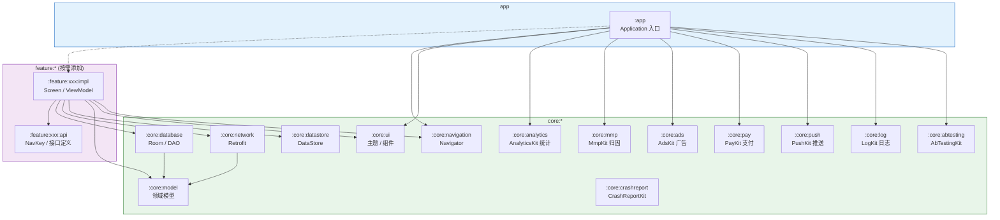

# Android 现代项目架构 AI 规则

**架构风格：** 基于 Now in Android 离线优先、模块化最佳实践

**角色：** Android 架构守护者，严格遵循 Now in Android 工程范式

**项目性质：** 多模块骨架/模板，无业务代码。所有 feature 模块需在真实项目中按需添加。

---

##  总体架构



- 采用 `app` / `feature:*` / `core:*` 三级模块化布局
- **Feature 模块必须拆分为 `:feature:xxx:api` 和 `:feature:xxx:impl` 两个模块**，外部仅依赖 api 模块
- **API 模块**只暴露导航公钥（NavKey）、接口和共享数据类，不包含 UI 或业务实现
- **依赖方向严格单向：** `app → feature:impl → core:*`
- **Feature 模块按需添加**，骨架项目不包含任何 feature 模块
- `applicationId` 和 `namespace` 是独立属性，初始默认一致但必须分别配置，禁止在逻辑中假设二者相同

---

##  架构决策记录 (ADR)

本项目使用 ADR（Architecture Decision Record）记录架构决策。

- **存放位置：** `docs/adr/` 目录
- **格式：** MADR（Markdown Architectural Decision Records）
- **模板：** `docs/adr/0000-adr-template.md`
- **状态定义：**
  - `Proposed` — 提议中，待评审
  - `Accepted` — 已接受，开始实施
  - `Deprecated` — 已废弃
  - `Superseded` — 被其他 ADR 替代
- **何时新增 ADR：**
  - 引入新的技术选型或第三方库
  - 修改已生效的架构规则
  - 任何涉及跨模块影响的架构决策
- **编写规范：**
  - 使用中文编写，技术名词保留英文
  - 编号按时间顺序递增
  - 状态必须明确标注

---

##  模块清单

### App 模块
- Application 入口，`startKoin` 加载所有模块
- 持有 Activity 和顶层 NavHost
- **无业务代码**

### Feature 模块
#### `:feature:xxx:api`
- 对外暴露导航公钥（`@Serializable NavKey`）
- 共享数据类、接口
- **无实现**

#### `:feature:xxx:impl`
- Screen Composable + ViewModel
- 暴露 Koin 模块声明 ViewModel

### Core 模块
#### `:core:model`
- 共享领域模型 `data class`
- **无逻辑**

#### `:core:network`
- Retrofit、OkHttp、序列化配置
- 提供 Remote DataSource
- **目录结构规范：**
  - `model/` 文件夹：存放网络响应 DTO（Data Transfer Object）

#### `:core:datastore`
- 封装 `DataStore<Preferences>`
- 提供 Local DataSource
- **只暴露挂起函数和 Flow**

#### `:core:database`
- Room 数据库配置、Entity 声明、DAO 接口定义
- Koin 的 `single` 绑定
- **目录结构规范：**
  - `model/` 文件夹：存放 Entity 实体类
  - `dao/` 文件夹：存放 DAO 接口
- **数据库迁移：**
  - 修改 Entity 时必须增加版本号
  - 简单变更使用 `AutoMigration`，复杂变更使用手动 `Migration`

#### `:core:navigation`
- 全局导航基础设施：Navigator 封装、NavEntry 接口
- 自适应布局辅助函数

#### `:core:ui`
- （可选）主题、设计系统组件、通用 Composable

#### `:core:testing`
- （可选）通用 Fake 实现、Turbine 扩展、测试规则

#### `:core:analytics`
- 透出 AnalyticsKit 门面（`api` 依赖 `analytics-firebase`）
- `AnalyticsInitializer` 统一初始化 Provider（Debug Logging + Firebase）
- `AnalyticsEvents` / `AnalyticsParams` 集中管理跨模块打点事件名与参数键
- 业务直接调用 `Analytics.logEvent(AnalyticsEvents.…)`，不另包 Helper / Koin

#### `:core:mmp`
- 透出 MmpKit 门面（默认 `mmp-appsflyer`）
- `MmpInitializer` + `MmpEvents` / `MmpParams`
- 业务直接调用 `Mmp.trackEvent` / `trackRevenue`；**按需**依赖，勿写入 feature.impl 约定插件

#### `:core:ads`
- 透出 AdsKit 门面（默认 `AdsKit-admob`）
- `AdsInitializer` + `AdsKeys`（Trigger / 测试 AdUnit）
- 业务直接调用 `AdsManager`；**按需**依赖
- `settings.gradle.kts` 需包含 AdsKit mediation Maven 仓库

#### `:core:pay`
- 透出 PayKit 门面
- `PayInitializer` + `PayProducts`（商品 ID 三分法）
- 业务直接调用 `PayKit.shared`；**按需**依赖

#### `:core:push`
- 透出 PushKit 门面（通知 DSL + FCM Provider）
- `PushInitializer` 创建默认渠道并注册 FCM
- `PushChannels` / `PushNotificationIds` 集中管理渠道与本地通知 ID
- 业务直接调用 `PushKitManager` / `notifyPush`；**按需**依赖

#### `:core:log`
- 透出 LogKit 门面（Logcat + 可选磁盘 + Compose 控制台）
- `LogInitializer`（Debug：`initAllLog`；Release：仅 Logcat）
- `LogTags` 集中管理跨模块 Tag
- 业务直接调用 `LogKit.d/i/w/e`；**按需**依赖

#### `:core:abtesting`
- 透出 AbTestingKit 门面（`api` 依赖 `abtesting-firebase`）
- `AbTestingInitializer`：install Firebase Provider → defaults → 异步 fetchAndActivate
- `AbTestingKeys` 集中管理远程参数 key 与本地 defaults
- 业务直接调用 `AbTestingClient.getXxx(AbTestingKeys.…)`，不另包 Helper / Koin

#### `:core:crashreport`
- 透出 CrashReportKit 门面（`api` 依赖 `com.github.e-hai:CrashReportKit`）
- `CrashReportInitializer`：`CrashReport.init` + 默认自定义键
- `CrashReportKeys` 集中管理自定义键名
- 业务直接调用 `CrashReport.log` / `recordException` / `setCustomKey`，不另包 Helper / Koin

#### `:core:video`
- 透出 VideoKit 门面（`api` 依赖 `com.github.e-hai.VideoKit:video`）
- `VideoInitializer`：集中初始化视频缓存与预加载配置
- 业务直接使用 VideoKit 门面与 Composable（如 `FeedCoverPlayerView`、`VodPlayer`、`ClipEngine` 等），不另包 Helper / Koin

---

##  Build-Logic 与 Gradle 约定插件

### 核心原则
- 项目根目录必须包含 `build-logic` 目录，作为约定插件的集中管理中心
- `build-logic` 通过 `includeBuild` 机制作为独立构建被引入
- 拥有独立的 `settings.gradle.kts` 和 `build.gradle.kts`
- `build-logic` 内部必须包含 `convention` 子模块，所有约定插件均定义在该模块中

### 插件设计规范
- 每个约定插件必须遵循**单一职责原则**，一个插件只完成一个特定配置任务
- 插件必须**可组合**，模块可按需应用多个插件
- 插件间可共享 Kotlin 扩展函数，避免重复代码

### 核心约定插件列表
AI 生成模块时必须根据模块类型选择正确的插件（插件 ID 前缀为 `myproject`，实际项目可替换为自定义名称）：

| 插件 ID | 用途 | 自动包含 |
|---------|------|----------|
| `myproject.android.application` | 配置 Application 模块 | Compose, Spotless |
| `myproject.android.library` | 配置纯 Kotlin/Java 库模块 | Spotless |
| `myproject.android.feature.api` | 配置 Feature API 模块 | Library, Serialization, Navigation3 |
| `myproject.android.feature.impl` | 配置 Feature Impl 模块 | Library, Compose, Koin, core:ui, core:navigation |
| `myproject.android.compose` | 增加 Compose 支持 | Compose Compiler, Compose BOM, Material3 |
| `myproject.android.room` | 配置 Room 数据库 | Room, KSP, Schema 导出 |
| `myproject.koin` | 配置 Koin 依赖注入 | koin-core, koin-android, koin-compose（根据环境） |
| `myproject.spotless` | 配置 Spotless 代码格式化规则 | ktlint |

### 使用示例
```kotlin
// 在模块的 build.gradle.kts 中应用插件
plugins {
    alias(libs.plugins.myproject.android.feature.impl)
}
```

**严禁重复样板配置！**

### 版本管理
- 所有第三方依赖版本统一通过 **Gradle Version Catalog**（`libs.versions.toml`）管理
- 约定插件中引用依赖使用 `libs.xxx` 语法
- 项目必须保证 `gradle/libs.versions.toml` 中的 `kotlin` 版本号与 `ksp` 插件版本号保持兼容性对齐，升级时必须成对更新

### 混淆配置
- 约定的 Library 插件必须配置 `consumerProguardFiles`
- 确保各模块携带自身混淆规则
- 防止 Koin 注入类与 `@Serializable` 类在 R8 混淆时被剥离

---

##  依赖注入 (Koin)

### 强制规则
- **强制使用 Koin**，全面禁止 Hilt、Dagger 及 `@Inject`、`@HiltViewModel` 等注解
- Application 类调用 `startKoin { modules(allModules) }` 加载所有模块

### ViewModel 声明
```kotlin
// Koin 模块
viewModel { MyViewModel(get()) }

// Screen 中获取
val viewModel = koinViewModel<MyViewModel>()
```

### Repository/UseCase/DataSource
```kotlin
single<MyRepo> { MyRepoImpl(get()) }
factory { SomeFactory() }
```

### CoroutineDispatcher
- **推荐通过 Koin 注入**（如 `named("io")`），便于测试时替换
- 允许在 ViewModel 或 Repository 中直接使用 `Dispatchers.IO`，但建议在构造参数中注入以获得更好的可测试性

---

## UI 层

### Jetpack Compose
- UI **完全使用 Jetpack Compose**
- **禁止 XML 布局、ViewBinding**

### 路由定义
- 路由定义为 `@Serializable data class/object`
- **禁止字符串路由**

### 自适应布局
- 在 Compose 中通过 `WindowSizeClass` 实现自适应布局

### ViewModel 规范
- 每个 Screen 对应一个 ViewModel
- ViewModel **只暴露一个 StateFlow<UiState>**
- 在 Composable 中收集 ViewModel 的 StateFlow **必须使用 `collectAsStateWithLifecycle()`**
- **严禁直接使用 `collectAsState()`**

### 事件处理
- **单次事件**（如 Toast、Snackbar 提示或外部跳转）必须设计为可消费状态或通过专门的事件 Channel/Flow 传递
- **严禁在 StateFlow 中永久保留**
- 用户操作处理方式二选一：
  1. 直接方法调用（如 `viewModel.onBookmarkClick()`）
  2. UiEvent 封装
- **选择后需统一**

### UiState
- `data class`，包含加载/成功/错误状态

### Composable 规范
- 可复用 Composable **必须无状态**，禁止持有 ViewModel
- **禁止在 Composable 中直接启动协程或访问数据源**

---

##  导航

- 所有导航操作通过 `core:navigation` 的 **Navigator 封装**进行
- 跨模块导航**仅通过** `:feature:xxx:api` 暴露的 NavKey
- **禁止在 ViewModel 中直接导入 NavController**

---

##  数据层 (Data Layer)

### Repository 实现
- 实现 Repository，组合 Remote + Local
- **离线优先策略**

### 本地存储
- 本地键值对存储**只允许 DataStore (Preferences)**
- 封装为 DataSource

### 数据转换
- DTO/Entity **必须通过 Mapper 转为领域模型**
- **禁止在模块间直接传递 DTO/Entity**
- **命名规范：**
  - 数据库实体类必须以 `Entity` 结尾（例如：`UserEntity`）
  - 网络响应类必须以 `Response` 结尾（例如：`UserResponse`）

### 时间处理
- 时间统一使用 `kotlinx.datetime.Instant`
- Room 用 TypeConverter 转换

### 错误处理
- 使用 `sealed class Result` 或 Kotlin Result
- **禁止返回 null**

---

##  测试

### Mock 策略
- **禁止使用 Mockito/MockK**
- **必须使用手写 Fake 实现**

### ViewModel 测试
- 使用 Turbine + Fake

### UI 测试
- 使用 Compose Testing + 语义操作

---

##  脚手架

### 占位符规范
- 生成脚手架项目时，所有 `applicationId`、`namespace`、代码包名统一使用占位符 `xxx.yyy.zzz`
- 目录结构按占位包名创建

### 初始化脚本
- 项目根目录生成 `init_project.sh` 脚本，用于一键替换占位符为真实值
- 脚本要求：
  - 彩色输出
  - 错误处理
  - 支持 `applicationId` 与 `namespace` 分别输入
- 脚本执行后项目应可直接编译运行

---

##  工程化

### Spotless 代码格式化
- 项目必须配置 Spotless
- 运行 `./gradlew spotlessApply` 格式化代码（后续用 `./gradlew :模块名:spotlessApply` 可格式化单个模块）
- CI 必须包含 `./gradlew spotlessCheck`
- Gradle 约定插件封装 Spotless 配置

---

##  构建与运行

### 常用 Gradle 命令

```bash
./gradlew assemble           # 编译全部模块
./gradlew check              # 运行所有检查
./gradlew spotlessApply      # 代码格式化 (ktlint)
./gradlew spotlessCheck      # 格式检查（CI 门禁）
./gradlew clean              # 清理构建产物
./gradlew :app:assembleDebug # 编译单个模块（替换模块名即可）
```

### 测试

测试命令：`./gradlew test`（单元测试），`./gradlew connectedCheck`（仪器化测试）。

**注意：** 本项目当前为脚手架，**尚无实际测试用例**。编写测试时请遵循以下规范：
- 禁止 Mockito/MockK，必须使用手写 Fake
- ViewModel 测试使用 Turbine
- UI 测试使用 Compose Testing + 语义操作

### 技术栈概要

| 领域 | 选型 |
|------|------|
| UI | Jetpack Compose (Material3, Icons Extended) via BOM 2026.05.01 |
| 导航 | Navigation 3 Runtime + UI（1.2.0-alpha04） |
| DI | Koin 4.2.1（core, android, compose） |
| 数据库 | Room 2.8.4 + KSP 2.3.8 |
| 键值存储 | DataStore Preferences 1.2.1 |
| 网络 | Retrofit 3.0.0 + OkHttp 5.3.2 |
| 序列化 | kotlinx-serialization 1.11.0, kotlinx-datetime 0.8.0 |
| 异步 | kotlinx-coroutines 1.11.0 |
| 分析 | AnalyticsKit（Firebase Analytics Provider） |
| A/B / 远程配置 | AbTestingKit（Firebase Remote Config） |
| 归因 | MmpKit（默认 AppsFlyer） |
| 广告 | AdsKit（默认 AdMob） |
| 支付 | PayKit（Google Play Billing） |
| 推送 | PushKit（通知 DSL + FCM） |
| 日志 | LogKit（Logcat / 磁盘 / 应用内控制台） |
| 崩溃上报 | CrashReportKit（Firebase Crashlytics） |
| 构建 | Gradle 9.x, AGP 9.3.1, Kotlin 2.3.21 |

### SDK / JVM 版本

- `compileSdk = 37.1`, `minSdk = 26`, `targetSdk = 34`
- Java 17 / Kotlin JVM target 17
- 所有依赖版本统一通过 `gradle/libs.versions.toml`（Version Catalog）管理

### 项目初始化

本项目为**脚手架模板**，创建真实项目时运行：
```bash
./init_project.sh   # 替换 xxx.yyy.zzz / myproject 占位符
```
脚本支持分别输入 `applicationId` 与 `namespace`，自动更新包目录结构和约定插件 ID。详见脚本文件中的注释。

---

## 多语言配置（i18n）

### 数据源
- 翻译文案统一由 `i18n/strings.xlsx` 管理，由产品经理维护
- **一个文件，多个 sheet**，每个 sheet 对应一个 Android 模块
- sheet 名称与模块的映射关系：
  - `app` → `app/`

### 表格格式
| key | en | zh | ja | ... |
|-----|----|----|----|-----|
| `app_name` | My App | 我的应用 | マイアプリ | ... |

- 首行：语言代码，首列固定为 `key`
- 首列（`en`）为默认语言，生成 `values/strings.xml`
- 其他列生成 `values-{lang}/strings.xml`

### 生成脚本
- `i18n/generate-i18n-strings.py`（Python + `openpyxl`）
- 读取 `i18n/strings.xlsx`，遍历每个 sheet，生成对应模块的 `strings.xml`
- 运行方式：
  ```bash
  pip install openpyxl
  python i18n/generate-i18n-strings.py
  ```

### 规范
- 新增模块时，在 `i18n/strings.xlsx` 中添加对应 sheet，同时更新脚本中的 `SHEET_TO_RES` 映射表
- 文案以 xlsx 为唯一权威来源，生成后的 `strings.xml` 不建议手动修改
- 脚本不纳入 Gradle 构建，PM 无需 Android 环境即可使用

---

## 禁止项

### 依赖注入
-  禁止 Hilt、Dagger
-  禁止 `@Inject` 注解

### 数据观察
-  禁止 LiveData

### 数据存储
-  禁止 SharedPreferences
-  禁止 Proto DataStore

### 协程
-  禁止硬编码 Dispatchers
-  禁止 GlobalScope

### 架构边界
-  禁止模块间直接传递 DTO/Entity
-  禁止在 UI 层导入 retrofit/room
-  禁止假设 applicationId 与 namespace 相同

### 其他
-  禁止 kotlin-android-extensions

---

##  代码命名规范

### 数据层命名

#### 数据库实体类 (Room Entity)
- **规则：** 必须以 `Entity` 作为类名后缀
- **位置：** `core/database/model/`
- **示例：** `UserEntity`, `ArticleEntity`

#### 网络响应类 (Network DTO)
- **规则：** 必须以 `Response` 作为类名后缀
- **位置：** `core/network/model/`
- **示例：** `UserResponse`, `ArticleResponse`

#### 领域模型 (Domain Model)
- **规则：** 使用业务名称，不加后缀
- **位置：** `core/model/`
- **示例：** `User`, `Article`

### UI 层命名

#### Screen (页面)
- **规则：** 以 `Screen` 作为后缀
- **示例：** `HomeScreen`, `DetailScreen`

#### ViewModel
- **规则：** 以 `ViewModel` 作为后缀
- **示例：** `HomeViewModel`, `DetailViewModel`

#### UiState
- **规则：** 以 `UiState` 作为后缀
- **示例：** `HomeUiState`

### 功能模块命名

#### Navigation Key
- **规则：** 以 `NavKey` 作为后缀
- **位置：** `feature/xxx/api/`
- **示例：** `HomeNavKey`, `DetailNavKey`

### 通用命名

- **变量：** camelCase，具有描述性（`userName`, `isLoading`）
- **常量：** UPPER_SNAKE_CASE（`MAX_RETRY_COUNT`, `API_BASE_URL`）
- **函数：** camelCase，动词开头（`getUserById`, `saveUser`）
- **接口：** 名词，不加 `I` 前缀（`UserRepository`, `DataSource`）

### 注释规范

- **所有类、函数/方法必须添加注释**，使用中文
- 注释说明职责和关键逻辑，不赘述代码本身已明示的内容
- 单行逻辑用行尾注释 `//`，复杂逻辑用块注释 `/* ... */`
- **示例：**
  ```kotlin
  /**
   * 首页页面组件，展示推荐内容列表。
   * @param onItemClick 点击列表项时的回调，携带对应的 NavKey
   */
  @Composable
  fun HomeScreen(viewModel: HomeViewModel = koinViewModel()) {
      ...
  }

  class HomeRepositoryImpl(
      private val remoteDataSource: HomeRemoteDataSource,
      private val localDataSource: HomeLocalDataSource,
  ) : HomeRepository {
      /**
       * 获取首页推荐内容列表。离线优先：先返回缓存，再拉取网络更新。
       */
      override fun getFeaturedItems(): Flow<Result<List<Item>>> { ... }
  }
  ```

---

##  最佳实践总结

1. **模块化清晰**：严格遵循 api/impl 分离
2. **依赖注入统一**：全部使用 Koin
3. **UI 现代化**：全面使用 Jetpack Compose
4. **离线优先**：数据层实现缓存策略
5. **类型安全**：使用 `@Serializable` 路由
6. **生命周期感知**：使用 `collectAsStateWithLifecycle()`
7. **代码注释规范**：类和方法必须写中文注释，说明职责而非语法
8. **版本统一管理**：使用 Version Catalog
9. **模块文档完善**：重要模块提供详细 README 说明

---

**最后更新：** 2026-05-29  
**适用项目：** Android 现代架构（Now in Android 风格）
